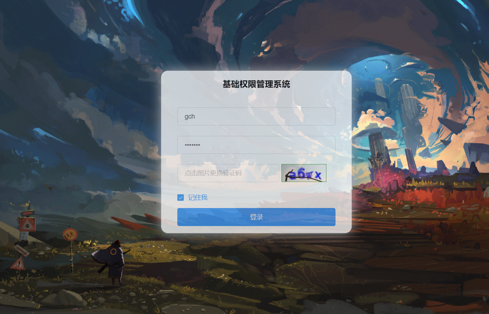
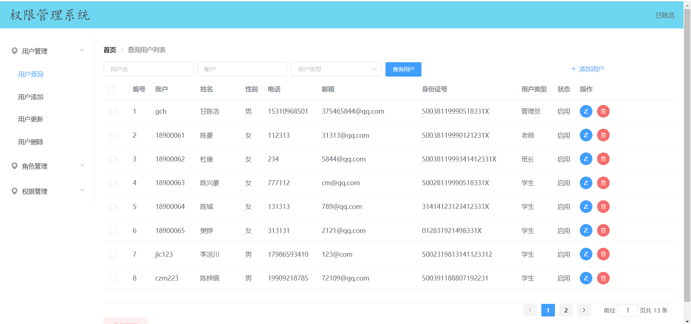
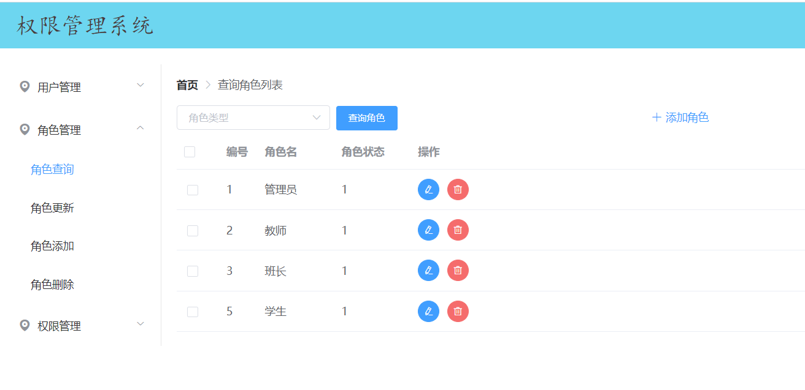
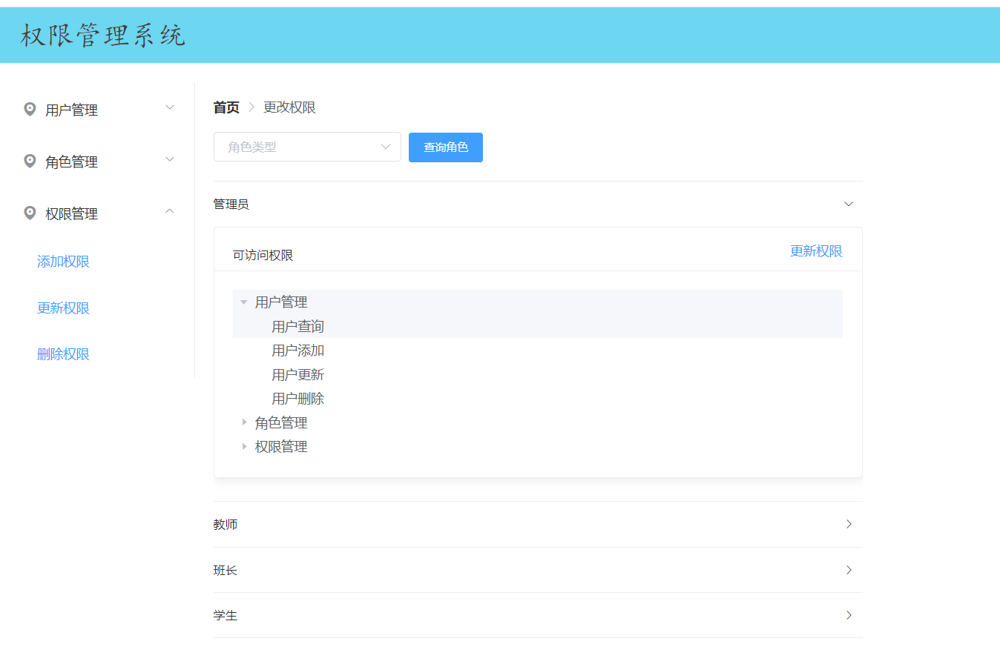
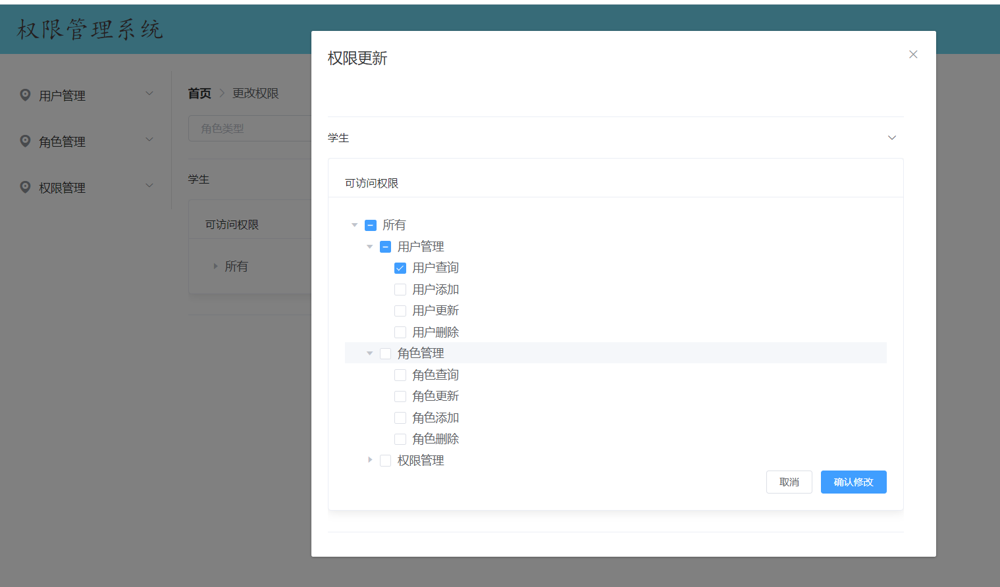

项目说明：使用Vue框架搭建的权限管理系统,主要界面:登录、用户管理、角色管理、权限分配

本项目后端使用Springboot swagger文档展示接口

后端项目Git地址：https://gitee.com/gan-chenhao/saber-rights-management-system.git

登录界面展示

用户管理界面展示

角色管理界面展示

权限查询界面

权限更新页面
